# 🌟 DreamAlign

**DreamAlign** is an AI-powered career coaching platform designed to align your dreams with actionable career goals. With personalized guidance from generative AI, a streamlined onboarding experience, and intuitive career tools, DreamAlign empowers you to explore, grow, and thrive.

<p align="center">
  
</p>

---

## 🚀 Features

* 🧠 **AI-Powered Career Coach** (Gemini API)
* 🔐 **Seamless Authentication** via Clerk
* 🗺️ **Personalized Onboarding** experience
* 🎯 **Career Path Strategy & Alignment**
* 🌈 **Light/Dark Theme** support
* 📊 **Data Management** with MongoDB & Prisma
* ⚡ **Performance-Optimized** with Next.js 15
* 💎 **Modern UI** with Shadcn components
* 📄 **Resume Builder**
* 📝 **Cover Letter Generator**

<!-- ---

## 🎥 Demo Video

Watch a walkthrough of the DreamAlign platform:

[](https://www.youtube.com/watch?v=your_video_id) -->


---

## 📸 Screenshots

<p align="center">
  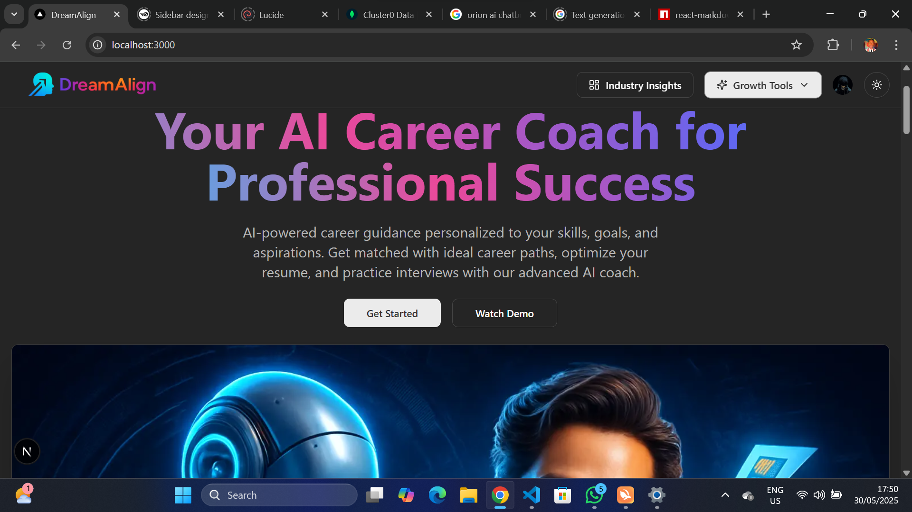
  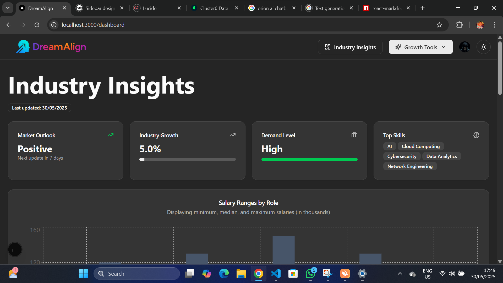
  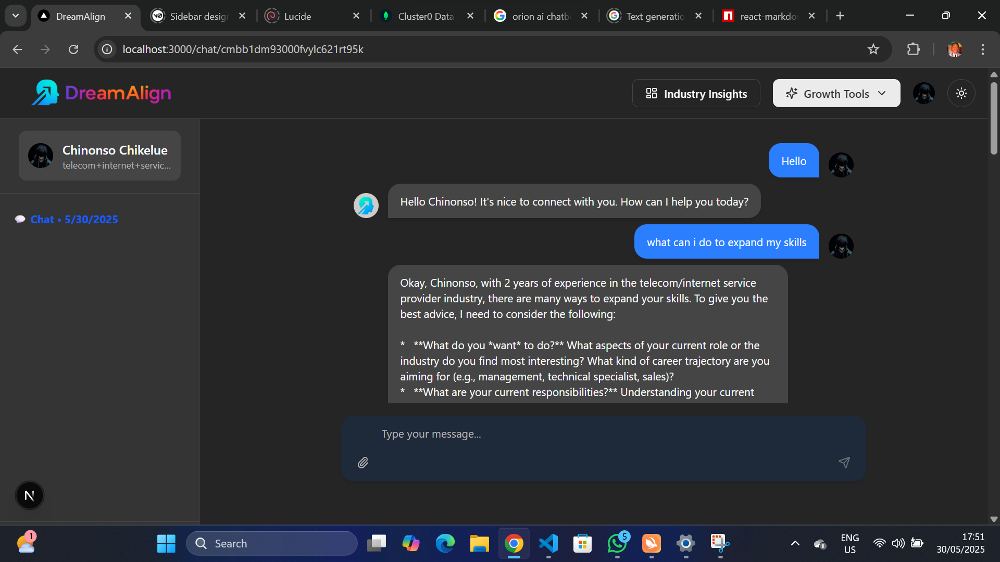
  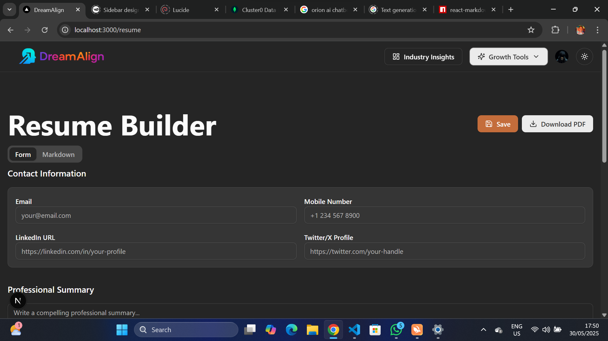
  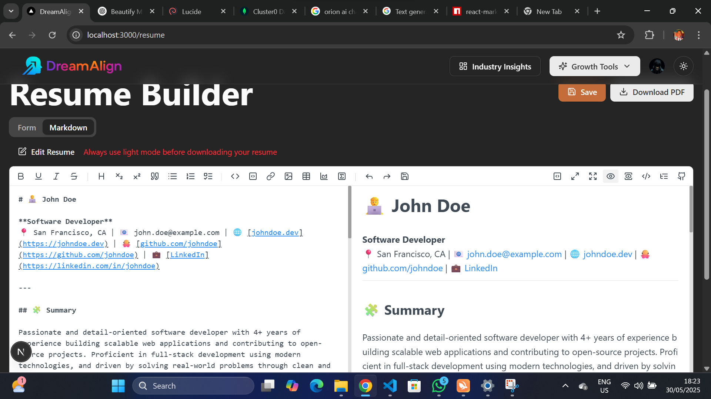
  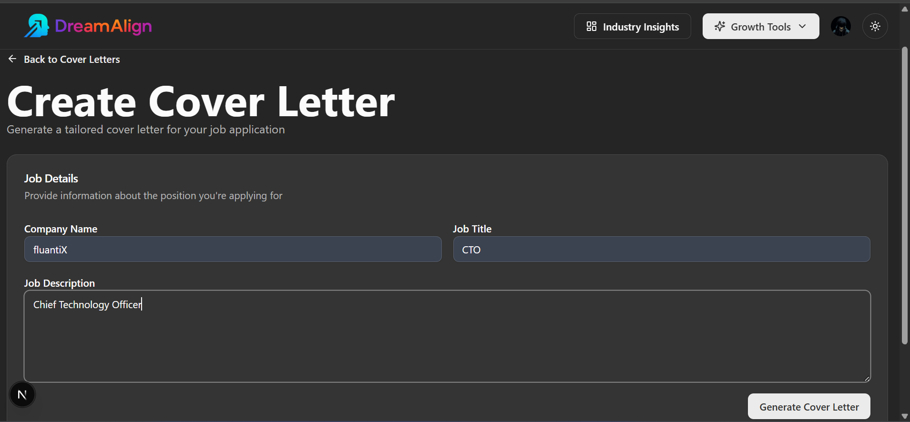
  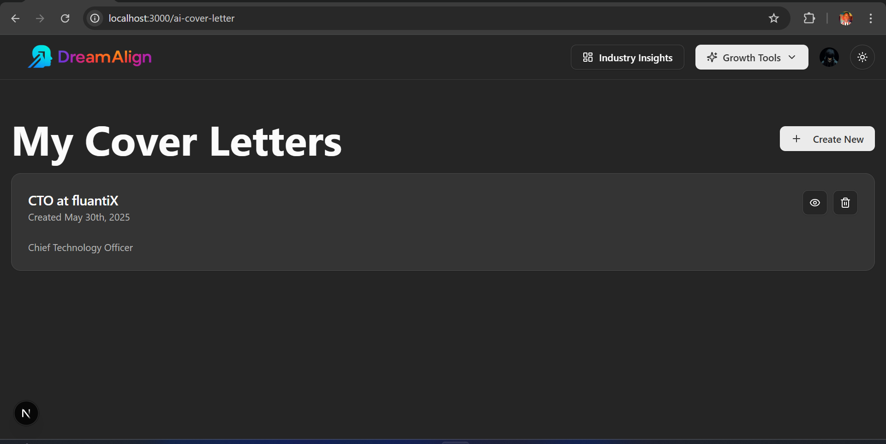
  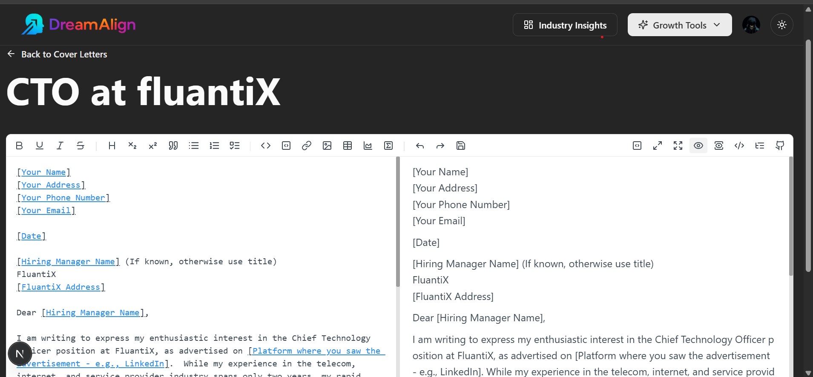
  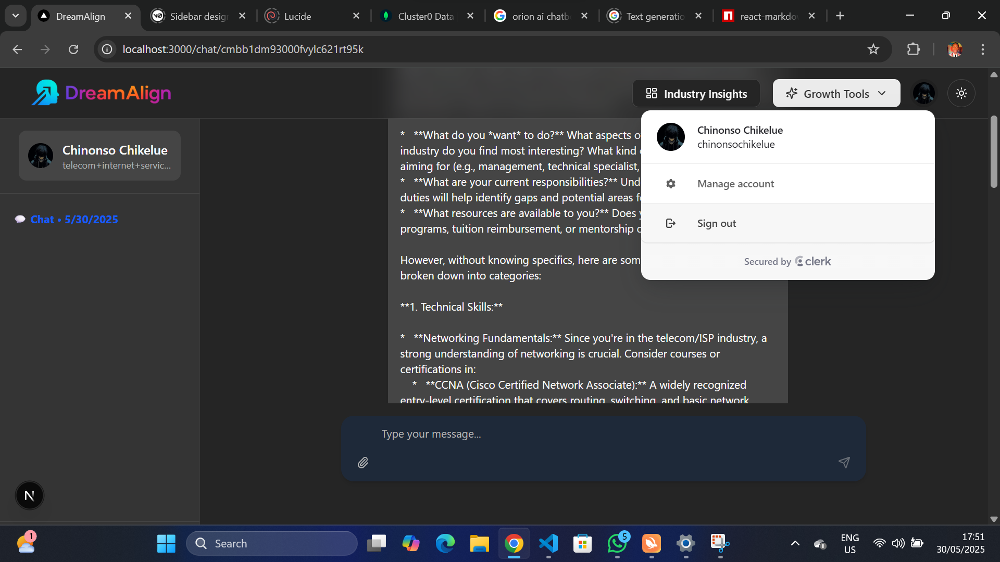
  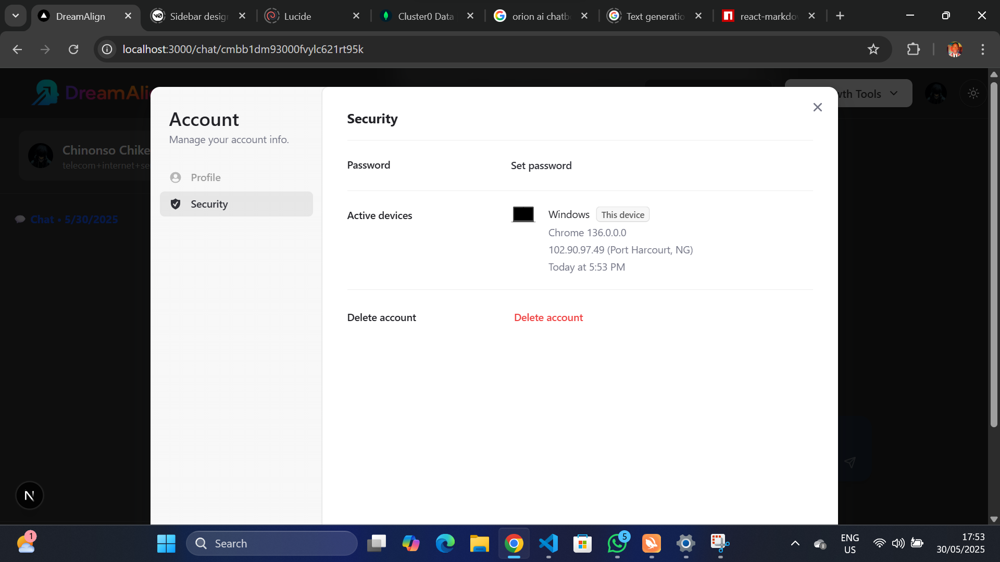
  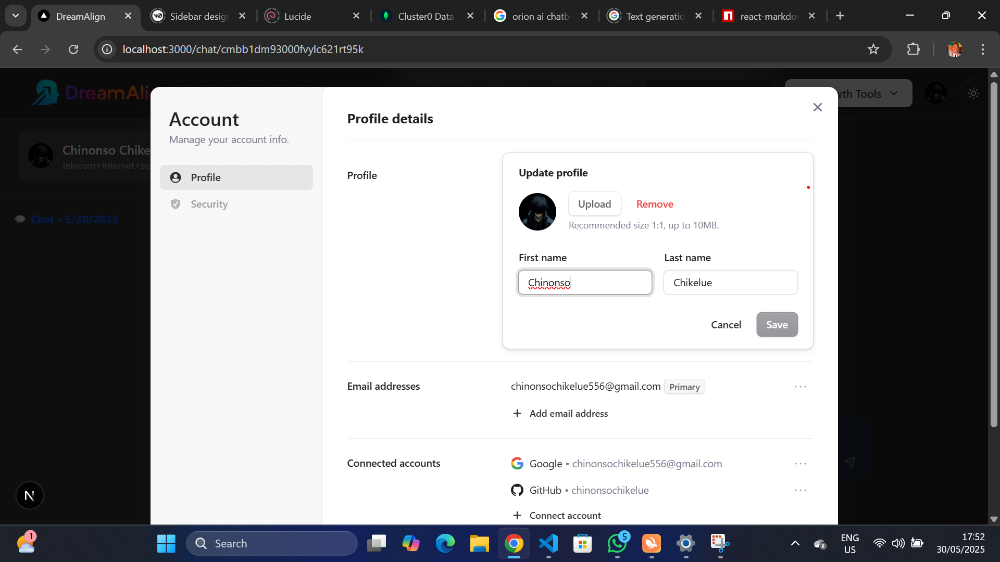
  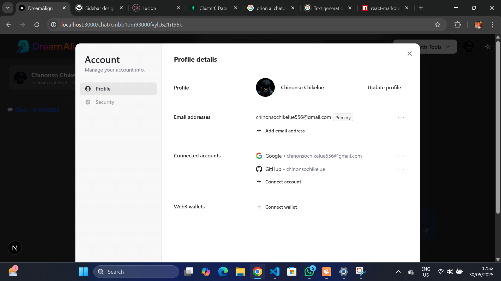
  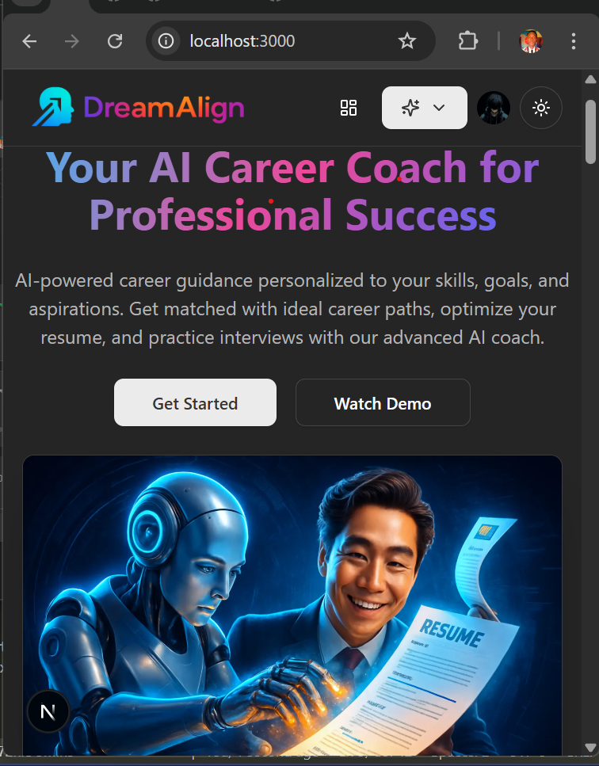
  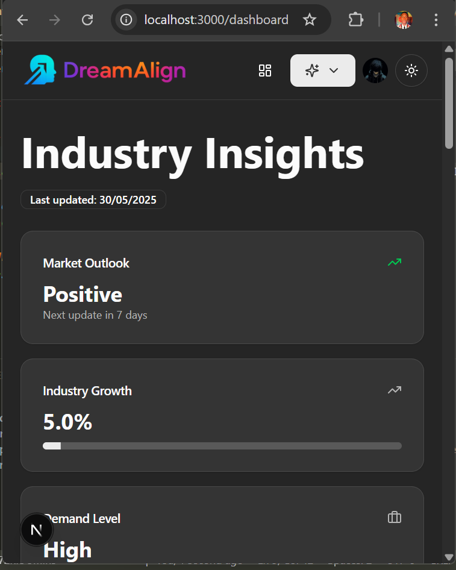
  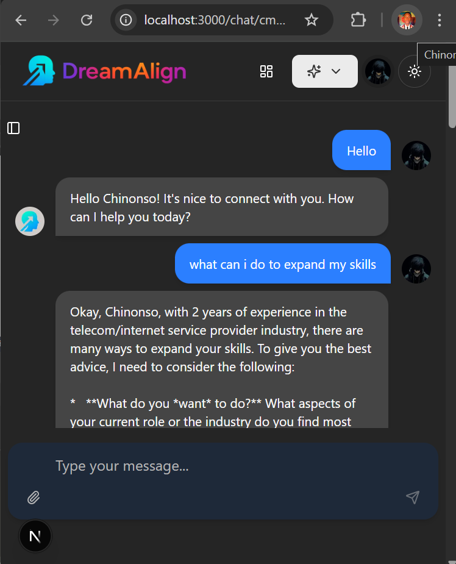
</p>

---

## 🛠 Tech Stack

| Category     | Technology                       |
| ------------ | -------------------------------- |
| **Frontend** | Next.js 15, Tailwind CSS, Shadcn |
| **Backend**  | Prisma, MongoDB                  |
| **Auth**     | Clerk.dev                        |
| **AI**       | Google Gemini API                |
| **Hosting**  | Vercel                           |

---

## 📦 Getting Started

### 1. Clone the Repository

```bash
git clone https://github.com/chinonsochikelue/DreamAlign.git
cd DreamAlign
```

### 2. Install Dependencies

```bash
npm install
```

### 3. Set Environment Variables

Create a `.env.local` file:

```env
DATABASE_URL=mongodb

NEXT_PUBLIC_CLERK_PUBLISHABLE_KEY=your_clerk_publishable_key
CLERK_SECRET_KEY=your_clerk_secret_key

NEXT_PUBLIC_CLERK_SIGN_IN_URL=/sign-in
NEXT_PUBLIC_CLERK_SIGN_UP_URL=/sign-up
NEXT_PUBLIC_CLERK_AFTER_SIGN_IN_URL=/onboarding
NEXT_PUBLIC_CLERK_AFTER_SIGN_UP_URL=/onboarding

GEMINI_API_KEY=your_gemini_api_key
```

### 4. Initialize Database

```bash
npx prisma db push
```

---

## 🧪 Run in Development

```bash
npm run dev
```

Open `http://localhost:3000` in your browser to view the app.

---

## 🌐 Deploying on Vercel

1. Push your repo to GitHub.
2. Connect the repo to [Vercel](https://vercel.com).
3. Set your environment variables in the Vercel dashboard.
4. Deploy — Vercel handles the rest!

---

## 📄 License

Released under the [MIT License](https://github.com/chinonsochikelue/DreamAlign/blob/main/LICENSE)
© [Chinonso Chikelue](https://github.com/chinonsochikelue)

---